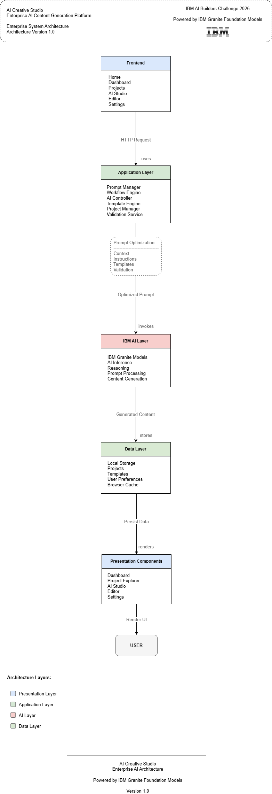

# Component Architecture

> Version: 1.0  
> AI Creative Studio

---

# Overview

The Component Architecture describes how the frontend application is organized into reusable, independent modules.

Each component has a single responsibility, enabling easier maintenance, testing, and future scalability.

The architecture follows a component-based design using React.

---

# Component Diagram



Source

- Draw.io: ../diagrams/Component-Diagram.drawio

---

# Component Hierarchy

```
App

├── Landing Page

├── Dashboard

├── AI Studio

├── Template Library

├── Project Workspace

├── Settings

└── Shared Components
```

---

# Core Components

## Landing Page

Responsibilities

- Product Introduction
- Call To Action
- Navigation
- Feature Overview

---

## Dashboard

Responsibilities

- User Projects
- Generated Content
- Recent Activity
- Analytics

---

## AI Studio

Responsibilities

- Prompt Editor
- Prompt Templates
- AI Generation
- Response Viewer

---

## Template Library

Responsibilities

- Template Categories
- Template Preview
- Template Selection

---

## Project Workspace

Responsibilities

- Project Management
- History
- Saved Prompts
- Export

---

## Settings

Responsibilities

- Preferences
- Theme
- Language
- AI Configuration

---

## Shared Components

Reusable UI components.

Examples

- Navbar

- Sidebar

- Buttons

- Cards

- Dialogs

- Inputs

- Modals

- Notifications

---

# Internal Communication

Component interaction follows a unidirectional flow.

```
User

↓

React Components

↓

Application State

↓

Prompt Engine

↓

IBM Granite

↓

Response Engine

↓

Dashboard
```

---

# State Management

Current implementation

- React Context

- React Hooks

Future expansion

- Redux Toolkit

- Zustand

---

# Design Principles

The component architecture follows:

- Component Reusability

- Separation of Concerns

- Single Responsibility Principle

- Atomic UI Design

- Modular Features

---

# Future Components

The architecture supports additional enterprise modules.

- Authentication

- Notifications

- Analytics

- AI Agents

- Marketplace

- Team Collaboration

- Billing

- API Integrations

---

# Quality Attributes

| Attribute | Status |
|-----------|--------|
| Reusable | ✓ |
| Maintainable | ✓ |
| Scalable | ✓ |
| Modular | ✓ |
| Testable | ✓ |

---

# Related Documentation

- [Architecture Overview](README.md)

- [System Architecture](System-Architecture.md)

- [Data Flow](Data-Flow.md)

- [Deployment Architecture](Deployment-Architecture.md)

---

# Conclusion

The component architecture enables AI Creative Studio to remain modular, scalable, and maintainable by organizing functionality into reusable React components that communicate through well-defined interfaces.