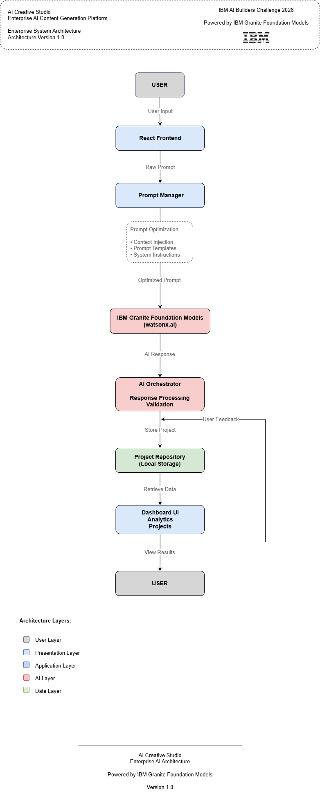

# Data Flow Architecture

> **Version:** 1.0  
> **Project:** AI Creative Studio  
> **Architecture Type:** AI Data Flow

---

# Overview

The Data Flow Architecture describes how information moves throughout AI Creative Studio, from user interaction to AI inference and final content delivery.

The architecture ensures that every request is validated, enriched, securely processed, and optimized before reaching IBM Granite Foundation Models.

This workflow improves response quality, application security, and future scalability.

---

# Data Flow Diagram



**Source**

- Draw.io: `../diagrams/Data-Flow.drawio`
- SVG: `../diagrams/exports/Data-Flow.svg`

---

# End-to-End Request Flow

The following sequence illustrates the complete lifecycle of an AI request.

```
User
    │
    ▼
React UI
    │
    ▼
Input Validation
    │
    ▼
Prompt Engineering
    │
Optimized Prompt
    ▼
IBM watsonx.ai
    │
    ▼
IBM Granite Foundation Models
    │
AI Generated Response
    ▼
Response Processing
    │
    ▼
Dashboard
    │
    ▼
Browser Storage
    │
    ▼
User Feedback
```

---

# Flow Stages

## 1. User Interaction

The process begins when a user submits a request through the AI Studio interface.

Typical actions include:

- Writing prompts
- Selecting templates
- Editing existing projects
- Generating AI content

---

## 2. Presentation Layer

The React application receives user input.

Responsibilities:

- User Interface
- Form Handling
- Client-side Validation
- State Management

Technology

- React
- TypeScript
- Tailwind CSS

---

## 3. Input Validation

Every request is validated before being processed.

Validation includes:

- Required fields
- Input length
- Prompt formatting
- Invalid characters
- Client-side safety checks

Purpose

Prevent malformed requests from reaching AI services.

---

## 4. Prompt Engineering

Rather than sending raw user input directly to the model, the application creates an optimized prompt.

Processing includes:

- Context Injection
- Prompt Templates
- Instruction Enhancement
- Prompt Optimization
- Safety Rules
- Formatting

Output

**Optimized Prompt**

---

## 5. AI Processing

The optimized prompt is sent to IBM watsonx.ai for inference.

IBM Services

- IBM watsonx.ai
- IBM Granite Foundation Models

Responsibilities

- Natural Language Understanding
- Reasoning
- Content Generation
- Structured Output
- Summarization

Output

**AI Generated Response**

---

## 6. Response Processing

The AI response is processed before reaching users.

Responsibilities

- Response Validation
- Safety Filtering
- Output Formatting
- Error Handling
- Rendering Preparation

---

## 7. Dashboard Rendering

The processed response is displayed inside the dashboard.

Displayed information includes:

- Generated Content
- Prompt History
- Projects
- Templates
- User Actions

---

## 8. Local Storage

Generated content is stored locally.

Current Storage

- Browser Local Storage
- Session Storage

Stored Data

- Prompt History
- Generated Content
- User Preferences
- Recent Projects

---

## 9. Feedback Loop

User interactions improve future AI responses.

Workflow

```
User Feedback
        │
        ▼
Prompt Refinement
        │
        ▼
Prompt Engineering
        │
        ▼
Optimized Prompt
        │
        ▼
IBM Granite
```

This continuous improvement cycle enhances response quality over time.

---

# Security Flow

Security is applied throughout the entire workflow.

Current protections include:

- Client-side Validation
- Prompt Validation
- HTTPS Communication
- Safe Prompt Construction

Future improvements

- JWT Authentication
- Role-Based Access Control
- API Authentication
- Rate Limiting
- Audit Logging

---

# Performance Optimization

The data flow has been optimized for responsiveness.

Current optimizations

- Lightweight React Components
- Efficient State Updates
- Local Storage
- Optimized Prompt Construction

Future optimizations

- Request Caching
- Response Caching
- Streaming Responses
- CDN
- Edge Computing

---

# Error Handling

Potential failures are managed at every stage.

Validation Errors

↓

Prompt Errors

↓

API Errors

↓

AI Service Errors

↓

Response Formatting Errors

↓

User Notification

---

# Future Data Flow

The architecture supports enterprise-scale expansion.

Future workflow

```
User

↓

Frontend

↓

API Gateway

↓

Authentication

↓

Backend Services

↓

IBM watsonx.ai

↓

Granite Models

↓

Database

↓

Analytics

↓

Dashboard
```

---

# Quality Attributes

| Attribute | Status |
|-----------|--------|
| Secure | ✓ |
| Scalable | ✓ |
| Maintainable | ✓ |
| AI-Optimized | ✓ |
| Enterprise Ready | ✓ |
| Extensible | ✓ |

---

# Related Documentation

- [Architecture Overview](README.md)
- [System Architecture](System-Architecture.md)
- [Component Architecture](Component-Architecture.md)
- [Deployment Architecture](Deployment-Architecture.md)
- [AI Architecture](AI-Architecture.md)

---

# Conclusion

The Data Flow Architecture provides a secure, structured, and AI-first workflow that transforms user input into high-quality AI-generated content.

By combining input validation, prompt engineering, IBM watsonx.ai, Granite Foundation Models, response processing, and continuous feedback optimization, the platform establishes an enterprise-grade data pipeline capable of evolving into a production-ready AI application.