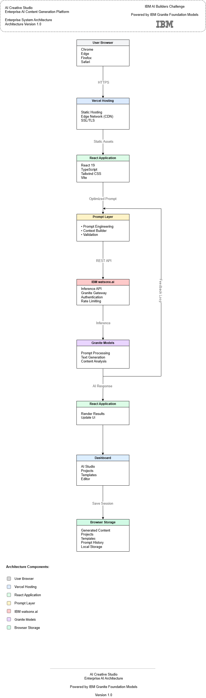

# Deployment Architecture

> **Version:** 1.0  
> **Project:** AI Creative Studio  
> **Architecture Type:** Cloud-Native Deployment  
> **Status:** Enterprise Deployment Roadmap

---

# Overview

The Deployment Architecture defines how AI Creative Studio is deployed, hosted, secured, and scaled across cloud infrastructure.

Although the current IBM AI Builders Challenge implementation is a frontend-first application, the architecture has been intentionally designed to support enterprise production environments without major architectural changes.

The deployment model follows modern cloud-native principles and is prepared for future backend services, persistent databases, authentication, monitoring, and continuous delivery.

---

# Deployment Diagram



**Source**

- Draw.io: `../diagrams/Deployment-Diagram.drawio`
- SVG: `../diagrams/exports/Deployment-Diagram.svg`

---

# Deployment Overview

The production deployment follows the architecture below.

```
Users

↓

CDN

↓

Frontend (Vercel)

↓

API Gateway

↓

Backend Services

↓

IBM watsonx.ai

↓

IBM Granite Foundation Models

↓

Database

↓

Monitoring
```

---

# Infrastructure Components

## Client Layer

Users access the application through modern web browsers.

Responsibilities

- User Interaction
- Authentication
- Content Creation
- Dashboard Access

---

## CDN Layer

Static assets are delivered through a Content Delivery Network.

Responsibilities

- Static Asset Delivery
- Performance Optimization
- Global Availability
- HTTPS

Examples

- Vercel Edge Network
- Cloudflare

---

## Frontend Layer

The frontend hosts the React application.

Technology

- React
- TypeScript
- Tailwind CSS
- Vite

Hosting

- Vercel

Responsibilities

- Rendering UI
- Routing
- Client Validation
- State Management

---

## API Gateway

Acts as the secure communication layer.

Responsibilities

- Request Routing
- Authentication
- Authorization
- Rate Limiting
- Request Validation
- Response Formatting

Future Technologies

- Express.js
- API Gateway
- Serverless Functions

---

## AI Services

The AI layer communicates with IBM services.

IBM Technologies

- IBM watsonx.ai
- IBM Granite Foundation Models

Responsibilities

- Prompt Processing
- AI Inference
- Content Generation
- Summarization
- Structured Responses

---

## Data Layer

Current implementation

- Browser Local Storage

Future implementation

- PostgreSQL
- IBM Cloud Databases
- Object Storage

Stored Data

- Projects
- Templates
- Prompt History
- Generated Content
- User Preferences

---

# Deployment Environments

## Development

Purpose

Local software development.

Technology

- Node.js
- Vite
- Local Browser

---

## Staging

Purpose

Internal testing before production deployment.

Future capabilities

- Automated Testing
- Preview Deployments
- QA Validation

---

## Production

Purpose

Public application deployment.

Hosting

- Vercel
- IBM Cloud

---

# CI/CD Pipeline

The deployment pipeline follows modern DevOps practices.

```
Developer

↓

GitHub

↓

GitHub Actions

↓

Code Quality Checks

↓

Automated Tests

↓

Production Build

↓

Deployment

↓

Monitoring
```

Pipeline Stages

- Source Control
- Build
- Linting
- Testing
- Artifact Generation
- Deployment
- Verification

---

# Containerization

Future enterprise deployments will support containerized infrastructure.

Technology

- Docker
- Kubernetes

Benefits

- Portability
- Scalability
- Consistency
- Automated Deployment
- High Availability

---

# Monitoring

Production environments will include monitoring services.

Metrics

- Application Health
- API Performance
- AI Response Time
- Error Rates
- Resource Usage

Future Tools

- Grafana
- Prometheus
- IBM Monitoring

---

# Logging

Centralized logging enables diagnostics and auditing.

Log Categories

- Application Logs
- API Logs
- AI Requests
- Authentication Logs
- Error Logs
- Audit Logs

---

# Security

Deployment security follows enterprise best practices.

Current

- HTTPS
- Client Validation

Future

- JWT Authentication
- Role-Based Access Control (RBAC)
- API Authentication
- Rate Limiting
- Secret Management
- Audit Logging

---

# Scalability

The deployment architecture supports horizontal growth.

Future capabilities

- Load Balancing
- Auto Scaling
- Multiple Instances
- Cloud Services
- Microservices
- Edge Deployment

---

# Backup Strategy

Future backup policy includes

- Daily Database Backups
- Incremental Backups
- Cloud Storage
- Version History
- Disaster Recovery Snapshots

---

# Disaster Recovery

The architecture supports enterprise recovery procedures.

Future implementation

- Multi-Region Deployment
- Automated Failover
- Backup Restoration
- Infrastructure Recovery
- Service Redundancy

---

# Future Evolution

The deployment model is prepared for future enterprise capabilities.

Roadmap

- Dedicated Backend Services
- IBM Cloud Deployment
- PostgreSQL Database
- Team Collaboration
- Enterprise Authentication
- AI Agents
- Analytics Platform
- API Versioning

---

# Quality Attributes

| Attribute | Status |
|-----------|--------|
| Cloud Ready | ✓ |
| Scalable | ✓ |
| Secure | ✓ |
| Highly Available | ✓ |
| Maintainable | ✓ |
| Enterprise Ready | ✓ |

---

# Related Documentation

- [Architecture Overview](README.md)
- [System Architecture](System-Architecture.md)
- [Component Architecture](Component-Architecture.md)
- [Data Flow](Data-Flow.md)
- [Security Architecture](Security-Architecture.md)

---

# Conclusion

The Deployment Architecture establishes a cloud-native foundation for AI Creative Studio by separating presentation, AI services, data persistence, and operational infrastructure.

Although the current implementation is optimized for the IBM AI Builders Challenge, the architecture has been intentionally designed to evolve into a secure, scalable, and production-ready enterprise platform capable of supporting future backend services, cloud infrastructure, continuous delivery, and large-scale AI workloads.