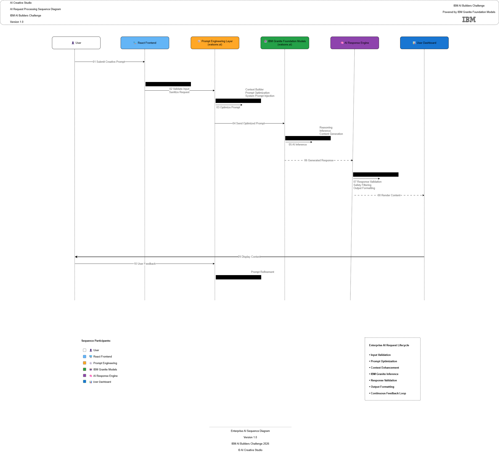

# Sequence Diagram

> Enterprise Sequence Diagram  
> AI Creative Studio  
> IBM AI Builders Challenge 2026

---

# Overview

The Sequence Diagram illustrates the complete lifecycle of an AI content generation request within AI Creative Studio.

It demonstrates how user interactions propagate through the frontend application, prompt engineering pipeline, IBM Granite Foundation Models, response processing, and finally return to the user interface.

The diagram follows enterprise software engineering practices and highlights the orchestration of the AI workflow.

---

# Objectives

The sequence diagram documents:

- User request lifecycle
- Prompt validation
- Prompt optimization
- IBM Granite inference
- AI response processing
- Content rendering
- Continuous feedback loop

---

# Sequence Diagram

> **Diagram Location**

```
docs/diagrams/Sequence-Diagram.drawio
```

> **Exported Files**

```
docs/diagrams/exports/Sequence-Diagram.png
docs/diagrams/exports/Sequence-Diagram.svg
```

---

## Enterprise Sequence Diagram



---

# Participants

| Participant | Responsibility |
|------------|----------------|
| User | Creates prompts and reviews generated content |
| React Frontend | User interface and request handling |
| Prompt Engineering Layer | Validation, sanitization and prompt optimization |
| IBM Granite Foundation Models | AI inference and content generation |
| AI Response Engine | Response validation and formatting |
| User Dashboard | Displays generated content and collects feedback |

---

# AI Request Lifecycle

The sequence follows these processing stages.

| Step | Description |
|------|-------------|
| 01 | User submits a creative prompt |
| 02 | Frontend validates and sanitizes the request |
| 03 | Prompt Engineering optimizes the prompt |
| 04 | Optimized prompt is sent to IBM Granite |
| 05 | IBM Granite performs AI inference |
| 06 | AI response is generated |
| 07 | Response validation and output formatting |
| 08 | Generated content is rendered |
| 09 | User reviews generated content |
| 10 | User feedback initiates prompt refinement |

---

# Prompt Engineering Responsibilities

The Prompt Engineering Layer performs several preprocessing tasks before invoking the AI model.

Responsibilities include:

- Input validation
- Request sanitization
- Prompt optimization
- Context enrichment
- System prompt injection

---

# IBM Granite Responsibilities

IBM Granite Foundation Models provide:

- Natural language reasoning
- Content generation
- AI inference
- Context-aware responses

---

# AI Response Processing

After inference, the response engine performs:

- Response validation
- Safety filtering
- Output formatting
- Content preparation

---

# Feedback Loop

The workflow supports continuous prompt refinement.

```
User
   │
   ▼
Feedback
   │
   ▼
Prompt Engineering
   │
   ▼
IBM Granite
```

This iterative workflow improves generated content quality through multiple refinement cycles.

---

# Enterprise Design Principles

The sequence diagram follows enterprise software engineering principles.

- Separation of Concerns
- Layered Architecture
- AI-First Workflow
- Modular Processing
- Prompt Engineering Pipeline
- Continuous Feedback Loop

---

# Related Documentation

- [System Architecture](./System-Architecture.md)
- [Component Architecture](./Component-Architecture.md)
- [Data Flow Diagram](./Data-Flow.md)
- [Deployment Architecture](./Deployment-Architecture.md)

---

# Conclusion

The Sequence Diagram illustrates the end-to-end AI request lifecycle within AI Creative Studio.

It demonstrates how enterprise prompt engineering, IBM Granite Foundation Models, response processing, and continuous user feedback work together to produce reliable, secure, and high-quality AI-generated content.